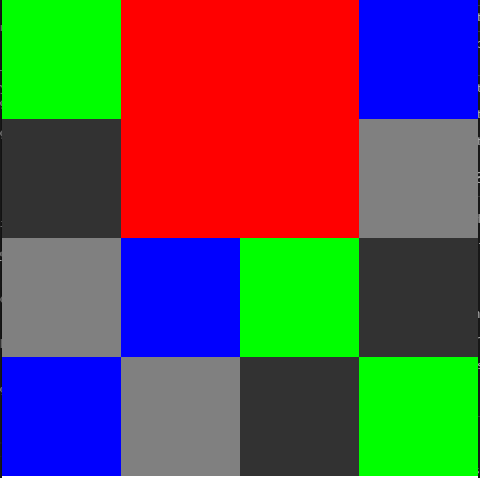
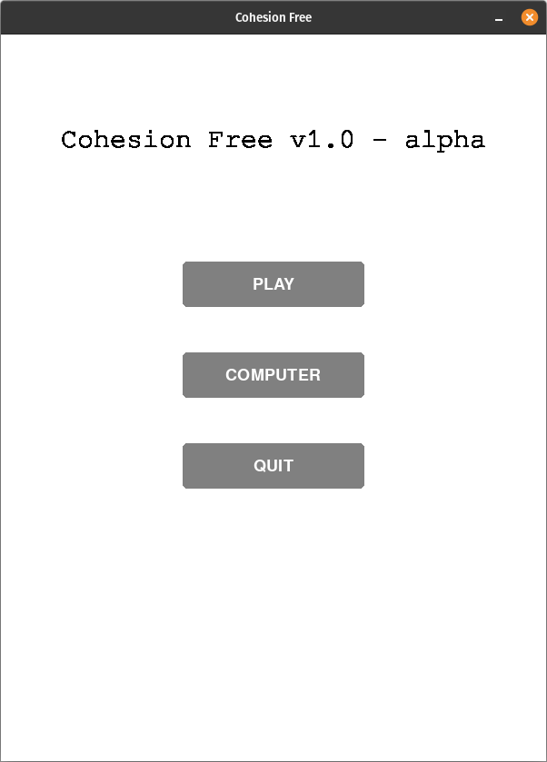
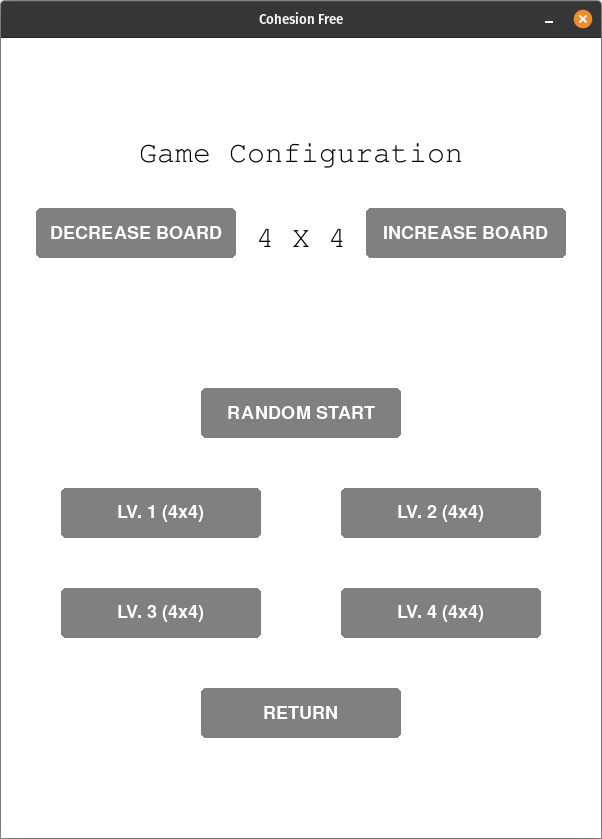
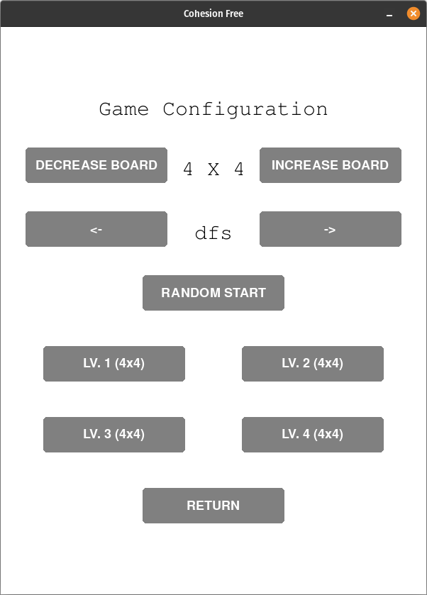
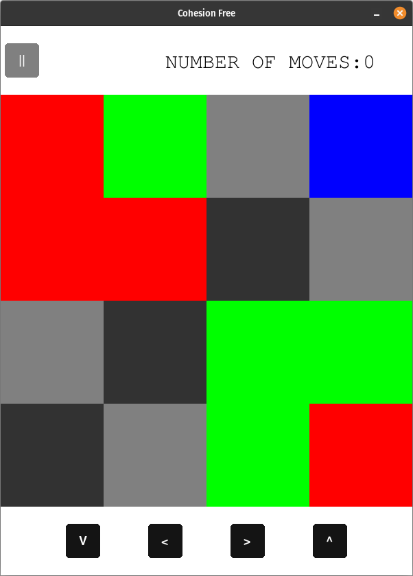
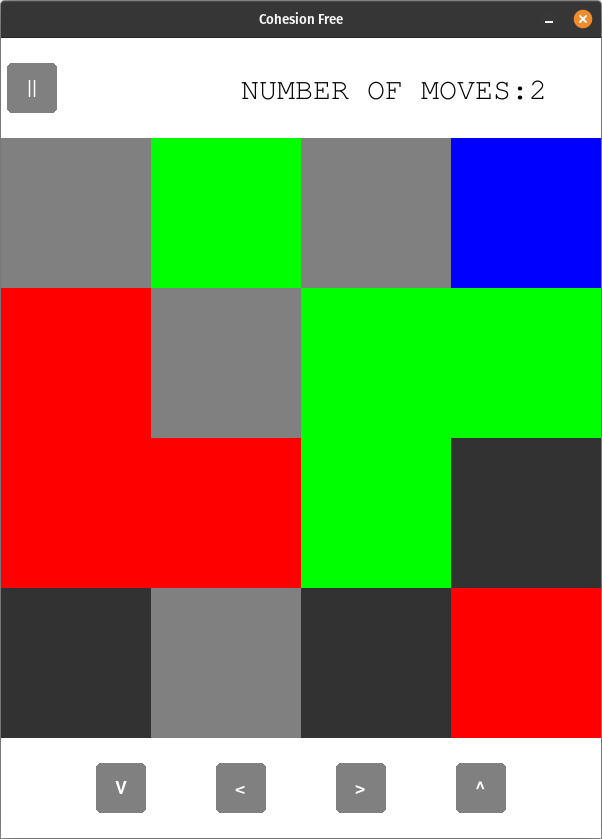
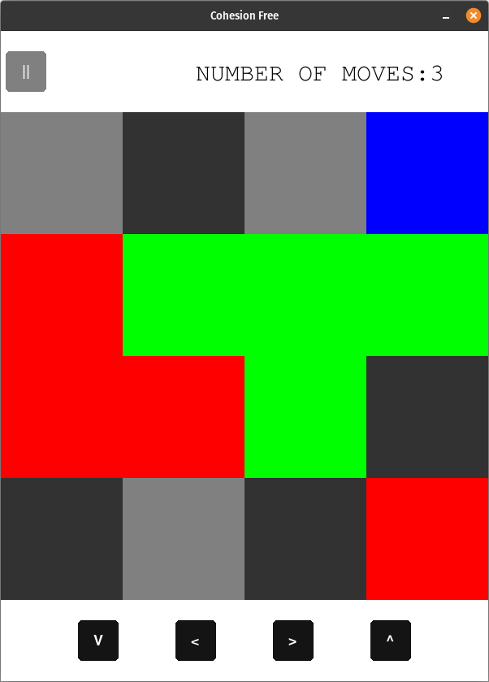
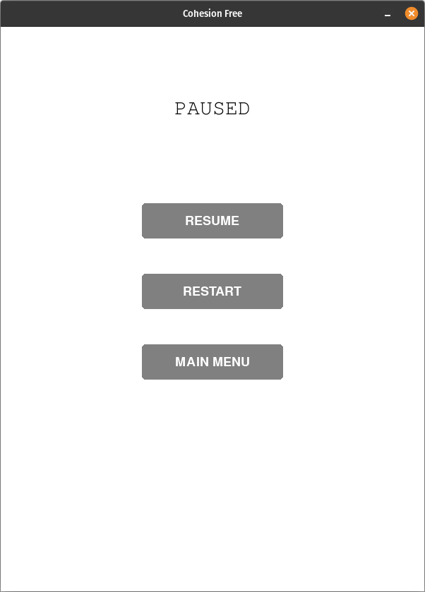
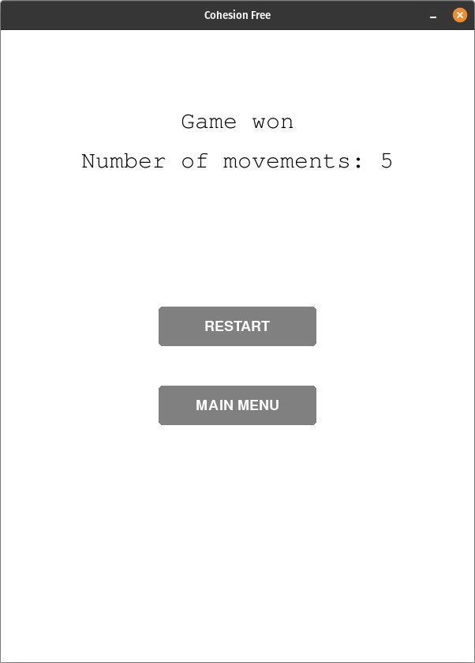
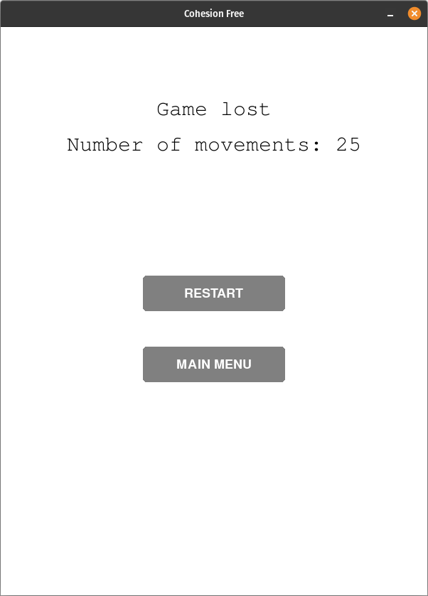

# COHESION FREE

Cohesion - The great "sticky" puzzle!

Cohesion is based on the classic "15 Puzzle", however it contains a fun twist...

The pieces in Cohesion are of various colors and shapes. And if two pieces of the same color touch each other, they bond together.. And be cautious, the bond is permanent!

# Dependencies

This project was made using python 3.10.6.

Additionally, to be able to run the program the following dependency are needed:

- pygame == 2.2.0

Pygame can be installed using: 

```
pip install pygame
```

or 

```
conda install -c conda-forge pygame
```

# Execution

The game can be started in these different ways:

> Run the pyhon script "main.py" > This can be done with the following way:
>
> From the main cohesion-free folder use:
> ```
>  python3 src/main.py
> ```
> &nbsp;


> If you are using Windows you may use the executable included:
>
> &nbsp; cohesion_free.exe
>
> and run it with:
> ```
> ./cohesion_free.exe
> ```
> &nbsp;

> If you are using linux you can also use the provided executable:
>
> &nbsp; cohesion_free.sh
>
> and running it with:
>
> ```
> ./cohesion_free.sh
> ```
> &nbsp;

# Structure of the project

The code of the game is stored in the "src" folder.

While "main.py" is directly in this folder other are inside "src/game".

The strucure of the game goes as follows:

| File         | Place      | Description |
| ------------ | ---------- | ----------- |
| main.py      | ./src      | Controls the flux of the game, it contains the menus and is reponsible for calling the game itself. |
| utils.py     | ./src/game | Contains functions that assists in the game functioning. e.g. a function that generates a noise map for random board generation |
| button.py    | ./src/game | Contains the implementation of the buttons used in the game |
| constants.py | ./src/game | Responsible to gather all the constant needed in the code in a single file for easier organization and changes if necessary |
| board.py     | ./src/game | Contains the representation and logic of the board needed in the game |
| piece.py     | ./src/game | Contains the representation and logic of a piece |
| computer.py  | ./src/game | Contains the implementation of the AI for automatic gameplays |

# How to play the game

The game consists of a board with differently colored pieces on it, As shown belows: <br>



The goal of the game is to group all the pieces of the same color together. To do this,
you will have to select a piece and move it (you may choose to move 1 unit up, down, 
left or right). 

Once two or more pieces of the same color touch each other they bond together and can only be moved together.

A game finishes once all pieces of the same color are grouped together on the board or if the player gives up the game.

Try to finish the game doing the least amount of moves. Have fun!

# Instructions

## Main menu

Once opening the game this is the screen you will be presented:



From this page you can choose to play the game yourself, computer mode gameplay or quit the game.

## Game configuration

After choosing you would like to play the game or the A.I. will play the game one of these two screen will be shown:





The only difference between the two is that selecting computer mode will also allow for the selection of the A.I. algorithm to be used.

The default board size is 4x4 but it can configured to be between 4x4 and 12x12.

When in computer game mode, the A.I. algorithms available are: bfs, dfs, iterative deepening search, greedy and a*.

After these configurations, you may start a rangom game (random generated board) or one of the predefined games.

## Game 

After the start of the game, you willbe presented with following screen:



The board is the represented by the gray checkerboard while the pieces are the different colored shapes on the board.

At the start, you will need to select a piece to move. This is as simple as using the mouse to click on the desired piece. You can verify if a piece is selected or not by checking if the buttons on the bottom of the screen are blacked out. For example:


I contrary, when a piece is selected the buttons will become gray. Just like the following:


After verifying that a piece is selected, you can move it by clicking the buttons on the bottom of the screen or using "wasd".

**Observertion:** A piece will continue seleted after a movement, the only time a piece becomes not seleted is if it's bonded with another one. Below is an example of this happening:





The game can also be paused by clickin the "||" button at the top.

## Pause

In the pause menu, you will have the following screen:



You may resume the game, restart it if you messed up the game (e.g. by making it impossible to win) or go back to the main menu.

## Game end

If you were able to win the game (or the computer did) this screen will be shown:



In case the computer lost the game the following screen will be presented:



**Observation:** When playing the game youself, it will not end the game when it becomes impossible to win. However, when in computer mode, the game will end if it cannot be won anymore.

# Important info

**When generating a random board there are no guarantee that a game will be possible to win. This is something that will be worked on. However will work for the current goals.**

# Credits

This game was made with love &hearts; by:

- Catarina Barbosa – up202004898@fc.up.pt​
- Francisca Andrade – up202005977@fc.up.pt​
- Marcos Ferreira - up201800177@fe.up.pt​
​
